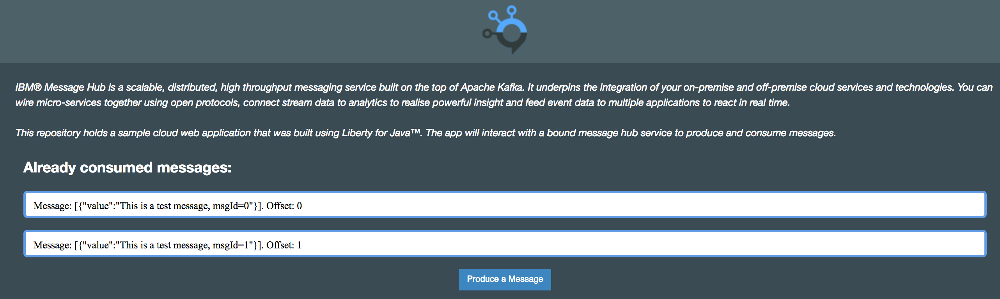
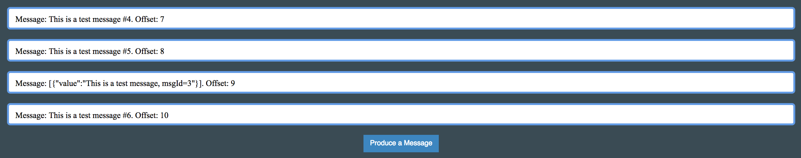

# Getting started with Message Hub


# Overview
IBM® Message Hub is a scalable, distributed, high throughput messaging service built on the top of Apache Kafka. It underpins the integration of your on-premise and off-premise cloud services and technologies. In this lab you will deploy and explore two sample applications using Message Hub on Bluemix.

## Prerequisites
You will need the following prerequisites for this lab:

* Bluemix supported [web browser](https://console.ng.bluemix.net/docs/overview/prereqs.html#prereqs)
* A Bluemix account
* [Cloud Foundry CLI](https://github.com/cloudfoundry/cli#downloads)
* [git](https://git-scm.com/)
* [Gradle](https://gradle.org/)
* Java 7+

# Step 1: Build the Java Liberty sample and deploy to Bluemix
In this step you will build the sample code, create an instance of Message Hub in Bluemix and deploy the first sample application.

1.  Clone the message-hub-samples repository and change into the directory for the java liberty sample:

    ```shell
    git clone https://github.com/ibm-messaging/message-hub-samples.git
    cd message-hub-samples/kafka-java-liberty-sample
    ```

2.  Build the sample application:

    ```shell
    gradle build war
    ```
    > You should see a directory called `target` created in your project home directory. A WAR file is created under `target/defaultServer`, as well as a copy of the server.xml file.

3.  Open the `manifest.yml` file in your favorite text editor for inspection and editing.

    ```yaml
    applications:
    - path: target/defaultServer
      memory: 512M
      instances: 1
      buildpack: liberty-for-java
      domain: mybluemix.net
      name: MessageHubLibertyApp
      disk_quota: 1024M
      random-route: true
      services:
        - "message-hub-service"
    ```

4.  Remove the `random-route` item and edit the `name`, appending your initials and the date to make a unique route. Save the `manifest.yml` file.

5.  The `manifest.yml` file references a Message Hub service named `message-hub-service`, create it using (substitute Bluemix region as needed):

    ```shell
    cf login -a https://api.ng.bluemix.net
    cf create-service messagehub standard message-hub-service
    ```

    > This command creates a service instance of type messagehub from the Bluemix catalog, using the standard plan, and names the service message-hub-service so that it will be bound to the application when it is pushed to Bluemix.

6.  Deploy the application to Bluemix:

    ```
    cf push
    ```

    > It will take a few minutes as the application artifacts are uploaded and the Liberty buildpack creates the droplet, and then the application is started. Once it is running, make a note of the application url that is shown.

    ```shell
    requested state: started
    instances: 1/1
    usage: 512M x 1 instances
    urls: messagehublibertyapp-tor-1709.mybluemix.net
    last uploaded: Fri Sep 22 15:59:54 UTC 2017
    stack: cflinuxfs2
    buildpack: liberty-for-java
    ```

# Step 2: Experiment with the application to monitor produced and consumed messages.
The application you deployed has both a producer and a consumer of messages. There is a web panel that provides a simple status display as messages are produced and consumed. Also, a running list of consumed messages by this application can be displayed by reloading the page.

1.  Open a browser and navigate to the app's url displayed in the output of the `cf push` command.

2.  On the app page, you can produce a message by clicking on the `Produce a Message` button. Note that there are intentional sleeps in the code that produce a delay of about 4 seconds.

    If the message was successfully produced and then consumed, you will then see the prompted message:

    **Already consumed messages:**
    ```shell
    Message: [{"value":"This is a test message, msgId=0"}]. Offset: 0
    ```

    **Produced Message:**

    *Message produced:* This is a test message, msgId=0

    **Consumed message**

    *Message consumed :* consumer is waiting for messages to be consumed ...

3.  If you produce more messages, the **Already consumed messages** section list will expand to include the additional messages.

    


# Step 3: Understand high-level aspects of using kafka api.
In this step you'll examine some bits of the application to see how the kafka java api is being used. This is optional and can be performed at a later time if desired.

1.  Use a code or text editor to open the `src/main/java/com/messagehub/samples/servlet/KafkaServlet.java` file.

2.  Scroll down to the `init()` function to see the setup steps for the application.

3.  First up on lines 112 through 154, `VCAP_SERVICES` is read and then parsed into a credentials object which is used to extract the `kafkaHost`, `restHost`, `apikey`, `user`, and `password` for the service.

4.  Then on lines 164 through 171, a topic `testTopic` is created using the kafka REST api endpoint.

5.  On line 174, a kafka Producer is initialized.

6.  On lines 177 through 179 a new thread is started for the kafka Consumer subscribing to the `testTopic` topic. The class definition for ConsumerRunnable is on lines 356 through 445.

7.  Note that at major points, log messages with the level WARN are emitted. You can check out these messages using the Bluemix UI, or monitor in real time using `cf logs <appname> | grep WARN`

# Step 4: Add another kafka producer using the console sample.
In this step, you will build and run from the command line another message producer. Once it is running, you'll be able to observe the liberty application consuming messages from both applications.

1.  Change over to the folder with the console sample and build the sample:

    ```shell
    cd ../kafka-java-console-sample/
    gradle clean && gradle build
    ```

2.  To run at the command line, you will need credentials to access the Bluemix Message Hub instance. You can get these by either opening up the Web UI and accessing the liberty application dashboard, and reading them from the `VCAP_SERVICES` or use the cf cli. To use the cf cli (replace `<appname>` with the name of your liberty app):

    ```shell
    cf env <appname>
    ...
    System-Provided:
    {
      "VCAP_SERVICES": {
        "messagehub": [
          {
           "credentials": {
            "api_key": "hu3............TFiNJ83",
            "instance_id": "dc75fc08-ccbe-44e9-8f7d-7aefab102a03",
            "kafka_admin_url": "https://kafka-admin-prod01.messagehub.services.us-south.bluemix.net:443",
            "kafka_brokers_sasl": [
             "kafka01-prod01.messagehub.services.us-south.bluemix.net:9093",
             "kafka03-prod01.messagehub.services.us-south.bluemix.net:9093",
             "kafka02-prod01.messagehub.services.us-south.bluemix.net:9093",
             "kafka04-prod01.messagehub.services.us-south.bluemix.net:9093",
             "kafka05-prod01.messagehub.services.us-south.bluemix.net:9093"
            ],
            "kafka_rest_url": "https://kafka-rest-prod01.messagehub.services.us-south.bluemix.net:443",
            "mqlight_lookup_url": "https://mqlight-lookup-prod01.messagehub.services.us-south.bluemix.net/Lookup?serviceId=dc75fc08-ccbe-44e9-8f7d-7aefab102a03",
            "password": "1in6f5..........TFiNJ83",
            "user": "hu3.......x4s"
           },
        "label": "messagehub",
        "name": "message-hub-service",
        "plan": "standard",
        "provider": null,
        "syslog_drain_url": null,
        "tags": [
         "ibm_dedicated_public",
         "web_and_app",
         "ibm_created"
         ],
        "volume_mounts": []
       }
      ]
     }
    }
    ```

3.  Combine all of the values of the `kafka_brokers_sasl` key into a single string enclosed in quotes. For example, for the credentials shown above, the string would be:

    ```
    "kafka05-prod01.messagehub.services.us-south.bluemix.net:9093,kafka02-prod01.messagehub.services.us-south.bluemix.net:9093,kafka01-prod01.messagehub.services.us-south.bluemix.net:9093,kafka03-prod01.messagehub.services.us-south.bluemix.net:9093,kafka04-prod01.messagehub.services.us-south.bluemix.net:9093"
    ```

4.  Start the command line client using this string for `<kafka_brokers_sasl>` and the following syntax (replacing with other items from the service credentials)

    ```shell
    java -jar build/libs/kafka-java-console-sample-2.0.jar <kafka_brokers_sasl> <kafka_admin_url> <api_key> -topic testTopic -producer
    ```
5.  Every second, the console application will produce a message. To see the messages being consumed, refresh the web page for the liberty application.

6.  Use the **Produce a Message** button again to produce a message from the liberty application.

7.  Inspect the **Already consumed messages:** display.

    

    > You will see that each producer has a unique id sequence, but that the offset, which is returned from the topic with each consumed message is regularly increasing. The offset works as an index into messages in the topic.

8.  Use `ctrl-c` in the terminal to halt the console producer application.

9.  If you like, you can change the role of the console application to that of a consumer by repeating the command above and replacing `-producer` with `-consumer`.

## Summary
This lab introduced two sample applications that use the java kafka producer/consumer api. You also learned how to create an instance of the Message Hub service and read the credentials of a service bound to an application using the Cloud Foundry CLI.
